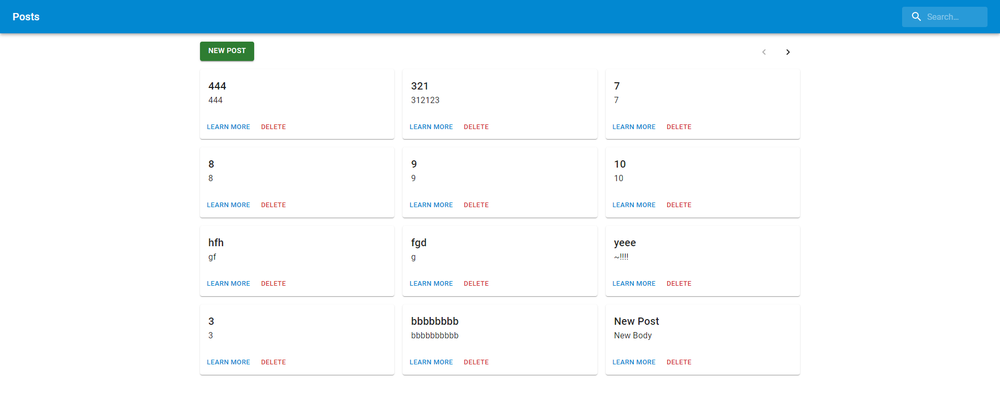
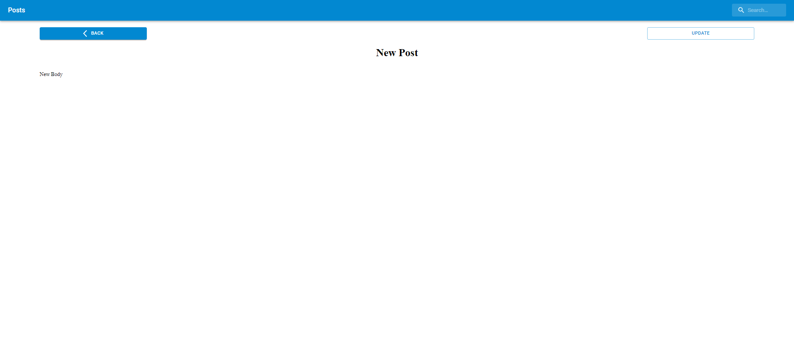

# posts-full-stack

### What is the purpose of the project

This project is educational and is intended for mastering CRUD

### The project uses:

- Frontend:

  - React
  - Redux
  - Redux-thank
  - WebPack
  - Material UI

- Backend:
  - Express js
  - Node js
  - Mongodb

## Main page

## Post page

